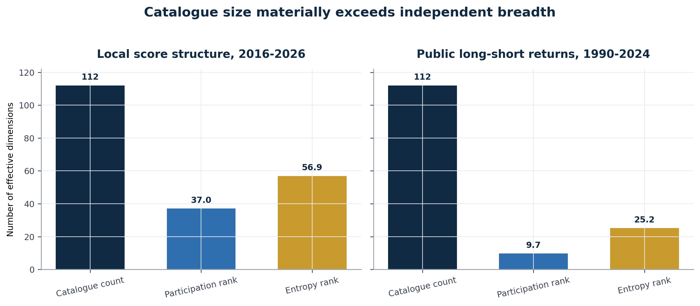
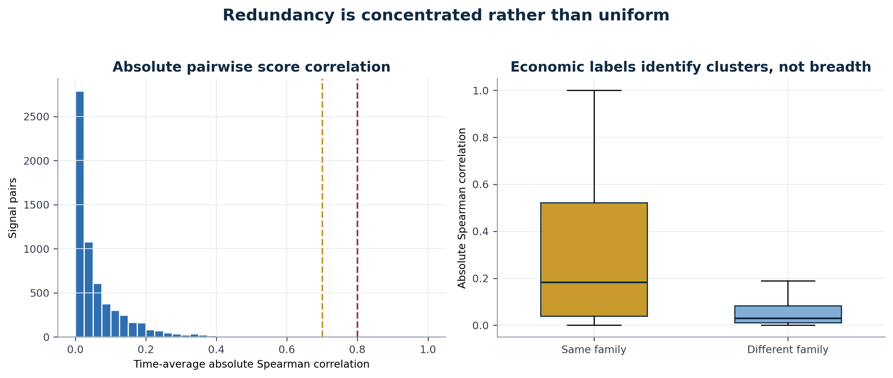
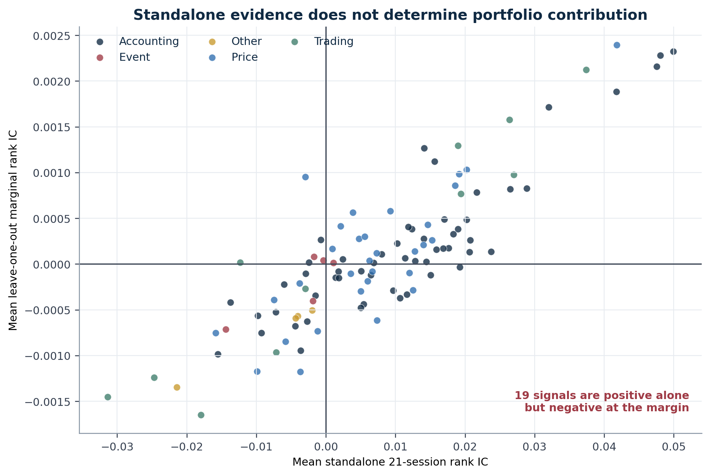
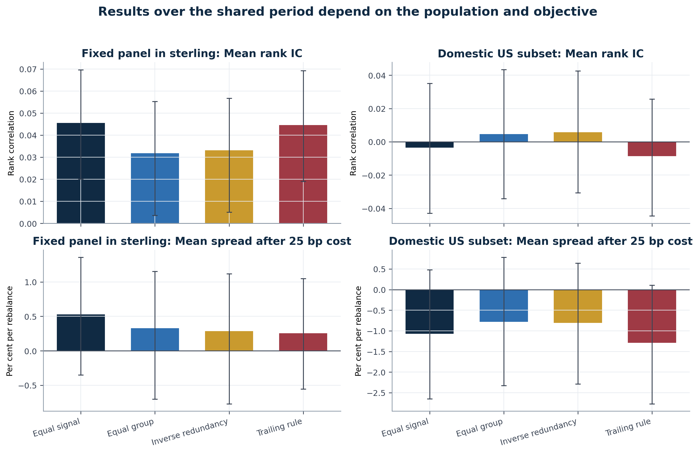
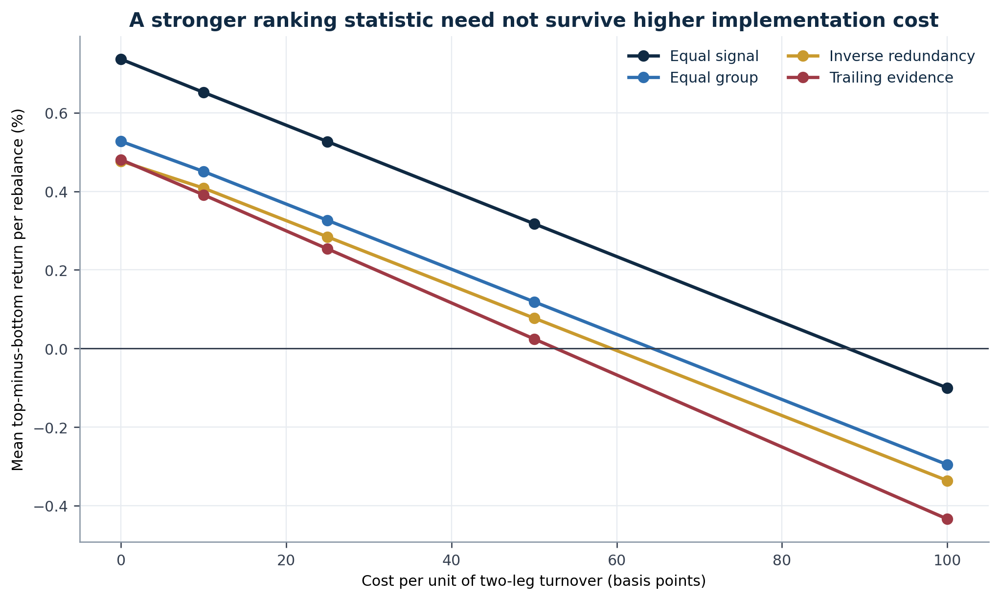
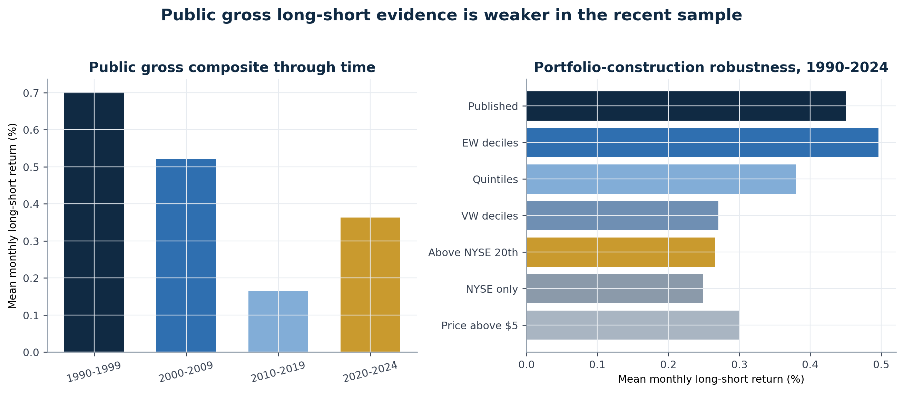
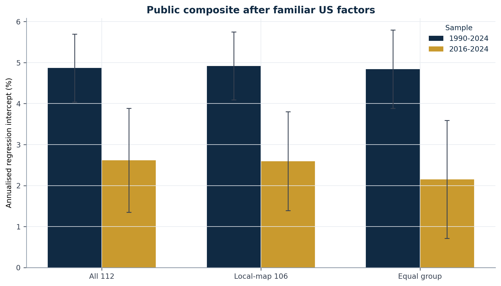
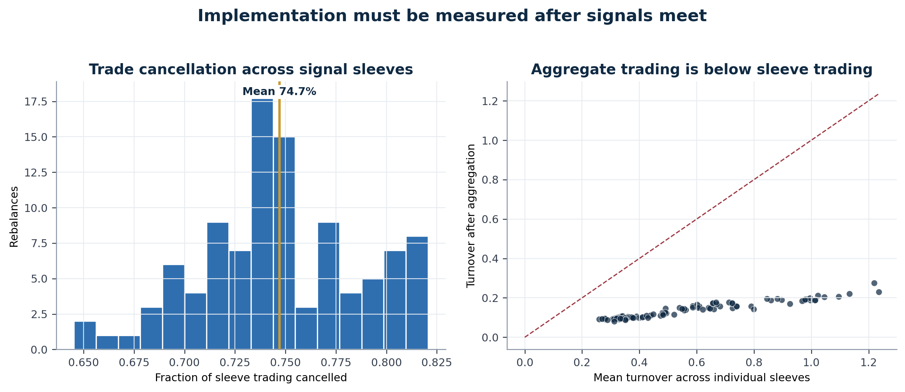

# From Signal Library to Portfolio

**Redundancy, Marginal Information and Capital Allocation Across Systematic Signals**

**Renato Guerrieri**  
Guerrieri Capital Ltd  
renato.guerrieri@guerriericapital.com  
July 2026

---

## Abstract

This paper asks how a portfolio manager should distinguish a large signal catalogue from independent information, and whether an individually credible characteristic deserves capital. The central distinction is between evidence for a signal in isolation and its marginal contribution to the portfolio that would use it.

Evidence comes from two sources. A local reconstruction of the Open Source Cross-Sectional Asset Pricing catalogue contains 164 characteristics, 3,000 equities and 31.9 million observations between June 2016 and June 2026; a fixed coverage rule retains 112 characteristics. The public Open Asset Pricing archive supplies 112 US long-short predictor returns from January 1990 to December 2024. The local panel permits security-level tests of scores, overlap, marginal information and trading, while the public archive provides a longer comparison of realised predictor portfolios.

The 112 local characteristics have a participation ratio effective rank of 37.05. Alternative matrix constructions place it between 36.34 and 38.10. Six exact relationships are found in the local score histories, and 106 representatives remain after the local duplicate audit. The number with any score ranges from 80 to 112 through time. A constant set of 67 representatives remains positive but somewhat weaker. Standalone evidence is incomplete: 75 characteristics have positive mean 21-session rank information in the fixed panel translated into sterling, but 19 of the 106 representatives are positive alone and negative when assessed against the full composite.

Return evidence depends materially on the population. The local equal signal composite is positive in the fixed panel in sterling, while the domestic US reconstruction does not confirm the result. The 112 public predictor portfolios are positive jointly over 1990-2024, but the evidence is weaker in the more recent period.

No allocation rule dominates consistently across populations, objectives and costs. The evidence therefore supports a decision standard rather than a universal weighting formula: capital should depend on credibility, distinct contribution, portfolio effect and implementation burden, each assessed against the portfolio that would own the signal.

**Keywords:** systematic signals; portfolio construction; factor redundancy; information coefficient; trading costs; capital allocation; quantitative equity.

**JEL Classification:** G11, G12, G14, G17, C52, C58.

---

## Executive Summary

A research team may have fifty, one hundred or several hundred signals. The relevant question is how many portfolio decisions it really has, and which of those decisions deserve capital.

Counting signals does not answer the question. Two entries may use different names and the same local formula. Two formulas may differ but rank the investable tail in much the same way. Several signals may be individually positive while adding nothing to a composite that already contains a stronger version of the same information. A further signal can also improve a statistical ranking and still worsen the portfolio after turnover, concentration or cost.

The analysis separates four decisions that are often collapsed into one:

1. **Credibility:** does the characteristic contain information about subsequent returns under a stated historical test?
2. **Distinct contribution:** is the information different from what the existing library already contains?
3. **Portfolio effect:** does the proposed addition improve a named portfolio on the objective that matters?
4. **Capital use:** does the improvement survive trading, risk, capacity and operational constraints?

Passing the first test does not confer a right to pass the other three.

The local evidence begins with 164 reconstructed characteristics. The broad coverage rule, fixed before the reported calculations, requires at least 80 signal dates and a median cross-section of at least 1,000 securities. It retains 112 characteristics. Twenty-eight are native local implementations and 84 are proxies for published definitions. Six exact duplicate relationships are found across the score histories. The main local portfolio comparison therefore uses 106 representatives.

Membership changes during the local history. The number of broad characteristics with any recorded score ranges from 80 to 112, with a median of 112. On the 103 dates used for the fixed panel return comparison, the number with at least 1,000 scores ranges from 74 to 112. A sensitivity using 67 representatives with at least 1,000 scores on every comparison date remains positive, although its rank information and result after the cost charge are lower.

The first result concerns breadth. The 112-characteristic score panel has a participation rank of 37.05 and an entropy rank of 56.90. A six-month block bootstrap places the participation measure between 35.80 and 37.80 at the 95 per cent level. Repaired alternative matrix constructions give participation ranks of 36.34 and 38.10. The corresponding native sample has 28 entries and a participation rank of 14.70. These figures are not recommendations for the number of signals to hold. They show that catalogue size is a poor proxy for independent variation.

The shape of the redundancy matters. Median absolute score correlation is only 0.0308, so the typical pair is not a close substitute. At the same time, 34 pairs exceed 0.80 and six pairs are exact duplicates. Median correlation is 0.1835 within the narrower economic families and 0.0298 across families. Taxonomy is therefore useful for locating likely clusters, but it cannot replace measurement.

The second result concerns the difference between standalone and marginal evidence. In the fixed panel translated into sterling, 75 of 112 characteristics have positive mean rank information over the next 21 sessions. Twenty-one remain positive after controlling the false discovery rate at 10 per cent. In the deduplicated sample, 58 of 106 characteristics improve the full equal signal composite in a leave-one-out comparison and 48 reduce it. Nineteen have positive standalone information but a negative marginal result. The portfolio can already own what a credible signal has to offer.

The third result is that allocation rules carry hidden economic choices. The deduplicated sample contains 55 accounting characteristics, 31 price characteristics, 11 trading characteristics, five event characteristics and four structural or other characteristics. Equal signal weights therefore allocate about 52 per cent of the available signal influence to accounting. Equal group weights allocate 20 per cent to each group. Neither convention is neutral.

That distinction explains much of the local result. The accounting group has a mean 21-session rank information coefficient of 0.0466 and a leave-one-group-out contribution of 0.0200. The event and structural groups are negative at the margin. Over the full 103-date comparable in sterling sample, the equal signal composite has a mean rank information coefficient of 0.0491 and a gross top-minus-bottom quintile spread of 0.909 per cent per rebalance. A 25 basis point charge per unit of two-leg turnover reduces the spread to 0.704 per cent. A six-month block bootstrap gives an interval of 0.104 to 1.276 per cent for that full sample cost result.

This is not enough to call equal signal weights the preferred rule. When the four allocation methods are compared over the same later period, the equal signal result after the same charge is 0.527 per cent, but its block bootstrap interval includes zero. Equal group, inverse redundancy and the trailing positive-evidence rule also have intervals that include zero. The inverse redundancy rule does not improve on the simpler alternatives. The trailing rule raises rank information relative to some alternatives but does not improve the return spread after cost. It achieves the statistic it was designed around, not every portfolio objective.

The fourth result is a direct challenge to portability. The domestic US subset contains 388 securities and 107 eligible characteristics, or 101 after deduplication. Its equal signal mean rank information coefficient is 0.0056 over the full period and its gross spread is negative. Over the shared period used to compare allocation rules, the mean rank information coefficient is negative. None of the four local allocation rules produces a positive mean spread after the 25 basis point charge in that US sample.

The public Open Asset Pricing archive provides a different and longer US record. Across 112 public long-short return series from 1990 to 2024, median absolute return correlation is 0.1642 and participation rank is 9.70. The return space is much more compressed than the local score space, although the two objects are not directly comparable. The equal signal composite across all 112 public portfolios averages 0.448 per cent gross per month over 1990-2024 and 0.218 per cent over 2016-2024. None of the 112 individual public predictors passes the 10 per cent false discovery threshold in the recent subperiod. A 106-series set obtained from the local reconstruction map gives similar results, but it is a sensitivity rather than evidence that the public portfolios are duplicates.

A factor regression against the Fama-French five factors and momentum produces a simulated annualised intercept of 4.87 per cent for the all-112 public composite over 1990-2024 and 2.62 per cent from 2016 to 2024. These are diagnostic regression statistics from historical gross simulations. They are not live alpha estimates and do not resolve implementation.

The deterioration tests are deliberately mechanical. During the worst decile of the public equal signal composite, a majority of predictor portfolios are negative in 95.2 per cent of months, compared with 26.9 per cent over the full period. The median overlap between each predictor's own worst return decile is 9.1 per cent, materially above the 5.3 per cent independence benchmark. Worst drawdown overlap is 6.3 per cent and only modestly above that benchmark. Common deterioration is present, but diversification in failure is not established uniformly.

Implementation changes the picture again. When each local characteristic is represented as an equal capital long-short sleeve, aggregation cancels an average of 74.7 per cent of sleeve trading. This supports portfolio-level rather than separate signal turnover analysis. It does not establish capacity. The same local composite has material region and currency exposures at some dates, and its gross return spread comes from the long basket while the short basket has a positive absolute return and therefore detracts from the long-short result. A positive spread cannot be described as neutral alpha without further attribution.

The conclusion is limited. Large signal libraries can contain useful joint information, but their row count overstates breadth, standalone evidence overstates portfolio contribution, and the best allocation method depends on the population, objective and cost. The portfolio manager's task is to decide which information the mandate should own, in what amount, and when that ownership should end.

---

## Introduction: The Capital Question Begins After Research Approval

A research library is an archive of hypotheses, definitions and test results. A portfolio is a set of exposures, trades and decisions under a mandate. Treating the first as if it were the second creates a predictable error: every approved research item acquires an implied claim on capital.

That claim is rarely stated. It appears through conventions. A new signal is added to an average. A new sleeve receives the same risk as the existing sleeves. A model is retained because removing a statistically positive input feels difficult to defend. Over time, the portfolio comes to reflect the history of the research catalogue rather than an explicit capital decision.

The problem is not that the underlying research must be false. Many published predictors have been reproduced, and collections of characteristics contain information jointly (Chen and Zimmermann, 2022; Jensen, Kelly and Pedersen, 2023). The problem is that validity in isolation and usefulness in a particular portfolio are different propositions.

A signal can be credible and still deserve no additional capital. It may rank the same securities as an existing input. It may add a variation that is statistically distinct but economically too small to carry. It may improve average rank correlation while increasing turnover or concentration. It may help a broad global panel and fail in a domestic sample. It may look diversified by label and behave like the same trade when liquidity is scarce. It can also remain valuable as a replacement, even when it is redundant as an addition.

This distinction is familiar in security selection. Markowitz (1952) made the portfolio, rather than the security in isolation, the relevant unit of risk and return. The same reasoning applies to forecasts. The contribution of one signal depends on what the portfolio already owns, how the signals interact and how the combined target is implemented.

The present study asks:

> How should a portfolio manager distinguish the size of a systematic signal catalogue from its independent information, and how should standalone research evidence be translated into a capital decision?

The answer is developed through three related comparisons.

First, catalogue count is compared with measured breadth. Pairwise score correlation, tail overlap, economic families and effective rank show where a large library contains repeated directions.

Second, standalone information is compared with marginal contribution. Each characteristic is assessed against the composite that would own it, not only against subsequent returns in isolation.

Third, allocation rules are compared after trading. Equal signal weights, equal group weights, an inverse redundancy rule and a trailing evidence rule are judged over the same dates and under the same cost sensitivity. The paper does not select a winner after seeing the results. It asks whether any rule earns that description under a stated objective.

Two empirical sources are used because one source cannot answer every question. The local reconstruction provides security-level scores and therefore permits direct tests of overlap, leave-one-out contribution, portfolio targets and trade cancellation. It has a short history, many proxy formulas and a fixed universe selected using information available near the end of the sample. The public Open Asset Pricing archive provides a much longer US record across published predictor portfolios. It is better suited to economic robustness through time, but it does not provide the same local score panel and contains a selected catalogue of documented predictors.

The tension between the sources is part of the result. The local fixed panel translated into sterling produces strong composite evidence. The domestic US reconstruction does not. The public US archive is strong over 1990-2024 but weaker in the recent period. A paper that reported only the favourable source would be easier to read and less useful to a portfolio manager.

The contribution is therefore methodological and empirical, but not promotional. It does not introduce an anomaly, a proprietary score or a live track record. It specifies what must be compared before a research result becomes a portfolio input and shows why that decision cannot be inferred from a standalone backtest.

---

## 1. The Decision Unit

### 1.1 Four separate decisions

The proposed discipline begins by separating four questions.

| Decision | Question | Evidence required |
| --- | --- | --- |
| Credibility | Does the characteristic relate to subsequent returns under a stated test? | Economic description, data timing, construction, horizon, stability and statistical inference |
| Distinct contribution | Is the information different from what is already available? | Score correlation, tail overlap, family cluster, residual evidence and common failure periods |
| Portfolio effect | Does the named portfolio improve when the signal is included? | Addition and removal tests, return attribution, risk, concentration and turnover |
| Capital use | Is the benefit sufficient after implementation and relative to other uses of capital? | Cost, liquidity, capacity, operational burden, mandate limits and monitoring triggers |

Research approval answers the first question. It may also justify keeping the signal in the library. It does not determine the portfolio role.

This separation permits outcomes other than approval or rejection. A credible signal may be retained as a research reference, used as a replacement for a weaker implementation, monitored in shadow form, given a limited role, or excluded from the active combination. The decision depends on the existing portfolio and can change when that portfolio changes.

### 1.2 Redundancy is not one statistic

There are several ways for signals to repeat information.

**Formula duplication** is the clearest case. Two catalogue entries may use the same local formula because the source data needed to distinguish them are unavailable.

**Score duplication** occurs when different formulas produce the same or nearly the same cross-sectional ranking.

**Portfolio duplication** occurs when two scores select much the same investable tail even if their full score correlation is moderate.

**Economic duplication** occurs when signals depend on the same underlying state, data source or risk exposure.

**Failure duplication** occurs when apparently distinct signals lose information together.

No single matrix identifies all five. The analysis therefore uses formula records, exact score audits, pairwise rank correlation, top and bottom overlap, family labels and performance through time.

### 1.3 Marginal contribution is conditional

Marginal contribution has meaning only against a named baseline. A signal may be redundant in a broad accounting composite and useful in a portfolio containing only price signals. A slower implementation may add value to a mandate with turnover limits even if a faster version has a higher standalone statistic. The same input may be useful at one horizon and unnecessary at another.

The baseline must therefore be part of the claim. Statements such as "the signal adds information" are incomplete unless they identify the portfolio, weights, population, period and objective against which the addition was measured.

### 1.4 Weighting conventions are capital decisions

Equal weights are often described as a neutral starting point. They are neutral only after the unit being weighted has been chosen.

Equal signal weights give more aggregate influence to groups with more catalogue entries. Equal group weights give a small group the same influence as a large one. Weights based on inverse correlation reward groups that look different over the chosen history. Trailing evidence rules reward recent strength and create estimation and turnover costs. None avoids judgement.

The question is not whether a rule is simple or sophisticated. It is whether the rule's implicit choice matches the mandate's objective and survives the costs it creates.

---

## 2. Relation to Existing Research

The portfolio foundation is Markowitz (1952). Expected contribution depends on covariance with the existing portfolio, not on the asset or forecast viewed alone. Grinold (1989) and Grinold and Kahn (2000) connect skill, breadth and active risk. In practice, the count of research entries is not breadth when forecasts are correlated or repeatedly express the same trade.

The factor literature gives a direct reason to audit large libraries. Harvey, Liu and Zhu (2016) show how the scale of factor discovery raises the statistical threshold required for a new claim. White (2000) and Bailey et al. (2017) address data snooping and backtest selection. Benjamini and Hochberg (1995) provide the false discovery procedure used here to control a family of tests rather than reading each nominal p-value in isolation.

The later evidence does not support a simple dismissal of documented predictors. Chen and Zimmermann (2022) reproduce a broad set of cross-sectional results using open definitions and code. Jensen, Kelly and Pedersen (2023) find that many factors replicate and can be organised into a smaller number of themes. Those findings are consistent with a library containing joint information and substantial redundancy at the same time.

Several studies move closer to marginal evidence. Green, Hand and Zhang (2017) assess 94 characteristics jointly and find a much smaller set of independent determinants. Freyberger, Neuhierl and Weber (2020) use a flexible selection method and again show that familiar predictors differ materially in incremental content. Feng, Giglio and Xiu (2020) test a proposed factor against a high-dimensional set of existing factors. Kozak, Nagel and Santosh (2020) show that the cross-section can be represented more reliably after shrinkage in principal-component space. The common point is that a new variable must compete with the information already available.

Implementation introduces another layer. DeMiguel, Garlappi and Uppal (2009) show how estimation error can erase the apparent advantage of a more elaborate allocation. Perold (1988) distinguishes a paper portfolio from the result achieved after trading. Novy-Marx and Velikov (2016) document how trading costs alter anomaly economics. DeMiguel, Martín-Utrera, Nogales and Uppal (2020) show that combining characteristics can reduce cost because trades offset. Standalone turnover is neither a complete cost estimate nor a reason to prefer a smaller library before examining the aggregate target.

Time also matters. McLean and Pontiff (2016) document weaker return predictability after publication. Khandani and Lo (2011) show how common quantitative exposures can fail together under pressure. These results motivate separate recent period evidence and direct examination of common negative months. They also argue against treating a full sample average as a permanent property.

The external factor diagnostics use the market, size, value, profitability and investment factors of Fama and French (1993, 2015) and the momentum factor associated with Carhart (1997). The regression is included to identify familiar systematic exposure in the public composite. It is not used to relabel a simulated intercept as live alpha.

The present paper differs from the asset-pricing literature in its decision target. It does not seek the true model of expected returns or the shortest list of statistically selected predictors. It asks what a portfolio manager should require before another item in a research catalogue receives capital.

---

## 3. Data and Evidence Boundaries

### 3.1 Local characteristic panel

The local source is a reconstruction of the Open Source Cross-Sectional Asset Pricing catalogue described by Chen and Zimmermann (2022). It was built to observe characteristic scores at security level. The reconstruction dated 15 June 2026 contains 164 implemented characteristics, 3,000 securities and 31,911,316 observations across 121 signal dates from 30 June 2016 to 12 June 2026.

The broad coverage rule was fixed before the reported calculations. A characteristic requires at least 80 signal dates and a median cross-section of at least 1,000 securities. The rule retains 112 characteristics and 30,210,764 score observations. The security, date and signal key is unique, and retained scores are complete.

The coverage rule does not require every characteristic to be present on every date. Across the 121 signal dates, the number with any recorded score has a minimum of 80, a median of 112 and a maximum of 112. On the 103 dates admitted to the fixed panel return comparison, between 74 and 112 characteristics have at least 1,000 scored securities; the median is 112. After duplicate representatives are selected, the corresponding range is 70 to 106 and the median is 106.

Twenty-eight characteristics are native local implementations. Eighty-four use proxy formulas because the exact source field, event history or source method is unavailable. The local analysis therefore concerns reconstructed characteristics. It is not presented as a replication of each published anomaly.

The broad sample contains 58 accounting characteristics, 34 price characteristics, 11 trading characteristics, five event characteristics and four structural or other characteristics. Six exact duplicate relationships are identified across the complete score histories. A representative is selected using a rule set before return comparison: native implementations take priority, followed by documented source code, source replication quality, date coverage, cross-sectional coverage and finally the canonical identifier. The principal local portfolio sample contains 106 characteristics after this audit.

### Table 1. Empirical populations

| Layer | Characteristics | Securities | Dates or months | Purpose |
| --- | ---: | ---: | ---: | --- |
| Source reconstruction | 164 | 3,000 | 121 dates | Archived local characteristic panel |
| Broad coverage sample | 112 | Up to 3,000 | At least 80 dates per characteristic | Score structure and credibility |
| Broad sample after exact deduplication | 106 | Up to 3,000 | At least 80 dates per characteristic | Principal local portfolio comparison |
| Native implementation sample | 28 | Up to 3,000 | At least 80 dates per characteristic | Proxy sensitivity |
| Domestic US subset | 107; 101 after deduplication | 388 | 101 return dates | Population robustness |
| Public Open Asset Pricing returns | 112 primary; 106 local-map sensitivity | Public US portfolios | 420 months, 1990-2024 | Independent external evidence |

### Table 1A. Active characteristics through time

| Period | Dates | Minimum | Median | Maximum |
| --- | ---: | ---: | ---: | ---: |
| 2016 | 7 | 80 | 80 | 80 |
| 2017 | 12 | 80 | 108 | 109 |
| 2018 | 12 | 109 | 110 | 110 |
| 2019 | 12 | 110 | 112 | 112 |
| 2020 | 12 | 112 | 112 | 112 |
| 2021 | 12 | 112 | 112 | 112 |
| 2022 | 12 | 112 | 112 | 112 |
| 2023 | 12 | 112 | 112 | 112 |
| 2024 | 12 | 112 | 112 | 112 |
| 2025 | 12 | 112 | 112 | 112 |
| 2026 | 6 | 107 | 112 | 112 |

Table 1A counts a characteristic as active when it has at least one recorded score on the date. The stricter 1,000-security count used in the return comparison is reported separately above.

### 3.2 Fixed population and survivorship

The 3,000 securities were selected in June 2026 from a larger security master using approximately ten years of price coverage and recent local price liquidity. This creates survivorship and availability bias. Earlier signal dates are evaluated on securities that were selected using information near the end of the panel. The sample is a fixed research population, not a historically investable universe.

That limitation is important. It may favour surviving securities with long records and may change both cross-sectional returns and signal coverage. The final empirical specification therefore treats score structure as the strongest local use of the panel. Return evidence is reported with the population limitation beside the result.

### 3.3 Returns translated into sterling

The earlier reconstruction used local-currency returns across a global panel. The reported calculations rebuild return labels from production total-return adjusted prices and exchange rates. Entry is the first valid local close after the signal date. Exit follows 21 local trading sessions for the common comparison, with 63, 126 and 252-session labels used for each characteristic's stated primary horizon. Local prices are translated into sterling at entry and exit using the last available exchange rate on or before the price date, subject to a five-calendar-day staleness limit. Currency subunits such as pence sterling, Israeli agorot and South African cents are normalised before conversion.

The translation addresses a clear comparability problem. It does not remove survivorship, local market structure or country composition. The resulting sample is called the fixed panel in sterling, not a global investable universe.

The price audit found mechanical vendor unit breaks in 33 securities. A holding window is excluded when an adjacent daily total-return price ratio falls below 0.2 or rises above 5. This removes 167 windows at the 21-session horizon. Raw labels are retained for audit. The principal return test is not winsorised, and a separate sensitivity winsorises each date at the 0.5 and 99.5 percentiles.

Calendar month-end records with only a few dozen securities are also excluded from return evidence. The fixed panel requires at least 1,000 securities with a score and clean label on the date; the domestic US sample requires 300. The resulting common 21-session tests contain 103 fixed panel dates and 101 domestic US dates. The minimum eligible populations are 1,526 and 381 respectively.

### 3.4 Domestic US subset

The domestic US test requires a US country code, US dollar currency, an ordinary company or equity security type, no fund flag and a recognised US exchange. Foreign-domiciled US listings and depositary receipts are excluded. The result is 388 securities. Of the 112 broad characteristics, 107 pass the US coverage rule and 101 remain after the same duplicate representatives are applied.

This sample improves currency and listing consistency. It is still drawn from the June 2026 fixed panel and is not a CRSP-style historical US universe. Its role is to challenge the portability of the local result, not to settle it.

### 3.5 Public Open Asset Pricing returns

The external source consists of official Open Asset Pricing predictor portfolio files. The principal period is January 1990 to December 2024. A characteristic requires at least 240 monthly observations, leaving 112 matches. All 112 published portfolios enter the primary external composite. The 106-series set selected by applying the local reconstruction map is reported only as a sensitivity; the map does not establish that any two official public portfolios are duplicates. The recent comparison covers January 2016 to December 2024 and requires at least 96 observations.

The published long-short return is the principal series. Alternative public files provide equal-weighted deciles, value-weighted deciles, quintiles, an NYSE-only screen, a price screen above five dollars and a market capitalisation screen above the twentieth NYSE percentile. These alternatives test whether the joint result depends on one public construction.

The public archive is an independent economic source, but it is not an untouched sample of every hypothesis ever tested. It is a catalogue of documented predictors. Its returns are gross of the portfolio costs relevant to an investor. The external evidence can challenge the local result and provide a longer historical comparison. It cannot validate the local formulas or establish a tradable net return.

### 3.6 Factor data

The public composites are regressed on the archived December 2024 Fama-French five-factor series and momentum. All factors and the public predictor portfolios are US series. The principal diagnostic includes market excess return, size, value, profitability, investment and momentum. Newey-West covariance estimates use six monthly lags.

The intercept is reported as a simulated regression statistic. It is not called alpha in the results because the regression operates on a selected set of gross historical simulations rather than live investor returns.

---

## 4. Empirical Design

### 4.1 Standalone rank information

For characteristic \(j\) at date \(t\), the information coefficient is the cross-sectional Spearman correlation between the score and the subsequent return:

\[
IC_{j,t,h}=\operatorname{corr}_{S}\left(s_{i,j,t},r_{i,t+h}\right).
\]

Scores and returns are re-ranked on the exact matched sample. Binary indicators are eligible when both values are present. Each date-level coefficient is one time-series observation. Securities within the same cross-section are not treated as independent observations.

The mean coefficient is tested using Newey-West covariance estimates (Newey and West, 1987). The lag is the return horizon expressed in months and rounded up, with a minimum of one. The Benjamini-Hochberg procedure controls the false discovery rate at 10 per cent within each stated family of tests (Benjamini and Hochberg, 1995).

### 4.2 Score correlation and tail overlap

Pairwise score redundancy is measured by Spearman correlation on each date with at least 200 common securities. The principal pair statistic is the time average; the effective rank audit also uses the time median. The full 112-characteristic sample contains 6,216 pairs, and all have an estimable correlation.

Tail overlap uses the Jaccard coefficient for the top and bottom quintiles:

\[
J(A,B)=\frac{|A\cap B|}{|A\cup B|}.
\]

Some sparse or binary characteristics do not form both tails under the common rule. Those cells remain missing. They are not imputed.

### 4.3 Effective rank

Let \(C\) denote the time average of date-level pairwise signed Spearman score correlations, with ones on the diagonal. The participation ratio effective rank is:

\[
N_{\mathrm{PR}}=\frac{\left(\sum_k \lambda_k\right)^2}{\sum_k \lambda_k^2},
\]

where \(\lambda_k\) are the non-negative eigenvalues. Because pair availability differs across dates, the aggregate matrix need not be positive semidefinite. The unrepaired 112-characteristic matrix has one negative eigenvalue, with magnitude 0.000981. The reported rank sets negative eigenvalues to zero. A robustness audit also applies the nearest symmetric positive semidefinite projection followed by diagonal normalisation, replaces time means with pairwise time medians, and averages repaired date-level matrices. Entropy rank is reported as a second measure. Neither statistic determines how many signals a portfolio should hold. Both describe how concentrated the matrix is in a smaller number of directions.

Uncertainty is assessed with a circular block bootstrap over signal dates. The principal block has six monthly observations and 2,000 replications. Three and twelve-month blocks are reported as sensitivities.

### 4.4 Standalone and marginal information

The equal signal composite is the mean percentile score across the available characteristics for each security and date. For characteristic \(j\), marginal information is the difference between the full composite's mean information coefficient and the mean after that characteristic is removed:

\[
\Delta IC_j=\overline{IC}_{\mathrm{full}}-\overline{IC}_{\mathrm{without}\ j}.
\]

A positive value means the characteristic improves this specified composite. The magnitude is small by construction because one signal is being removed from a set of 106. The sign, inference and economic role are more useful than a direct interpretation of the coefficient as a proposed weight.

The same logic is applied to the five broad groups. Each group composite is the mean score across its constituent characteristics. Leave-one-group-out evidence asks whether the equal group composite is stronger with that group than without it.

### 4.5 Allocation rules

Four allocation methods are compared.

1. **Equal signal:** every characteristic receives the same influence.
2. **Equal group:** each of the five broad groups receives the same influence.
3. **Inverse redundancy:** group weights are inversely related to their trailing 36-observation mean absolute correlation with the other group composites. The current date is excluded.
4. **Trailing positive-evidence rule:** a group is included when both its standalone and leave-one-group-out mean information coefficients are positive over the preceding 36 observations, with an embargo of one observation. At least two groups must remain.

The two adaptive rules begin later. Comparisons between all four methods therefore use dates on which every rule is available. This leaves 67 fixed panel dates for information and gross spread, and 65 domestic US dates. Cost comparisons require a preceding target for every method and contain 66 and 64 observations respectively. The full history remains relevant for the fixed rules, but it is not used to claim that an adaptive rule is better or worse over a different period.

No rule is designated preferred in advance. A rule would earn that description only if it met a stated objective after cost and showed adequate robustness. The empirical question is whether any method clears that standard.

### 4.6 Return spreads, turnover and cost

Each composite forms equal-weighted top and bottom quintiles. The gross spread is the top return minus the bottom return. Two-leg turnover is the sum of the replacement rates in the two baskets. Cost sensitivities subtract 10, 25, 50 and 100 basis points for each unit of two-leg turnover.

These are mechanical sensitivities. They exclude commissions, taxes, bid-ask variation, borrow, financing and market impact. A positive result after the charge is not described as an executable net return.

The principal confidence interval uses a circular six-month block bootstrap with 2,000 replications. The same dates are used across allocation rules within each population and metric.

### 4.7 Trade cancellation

Portfolio turnover cannot be inferred by adding standalone signal turnover. A separate implementation test forms an equal capital long top quintile and short bottom-quintile sleeve for every eligible characteristic. A sleeve is active only when at least ten securities form each side. Trade cancellation is:

\[
1-\frac{\text{turnover after sleeve aggregation}}{\text{weighted average sleeve turnover}}.
\]

This construction measures whether opposing signal trades offset before execution. It is separate from the rank composite return portfolios and is not used to adjust their cost result.

### 4.8 Publication controls

The empirical specification was frozen on 21 July 2026 before the reported outcome calculations. Corrections found during validation are recorded separately. They cover thin calendar dates, binary indicators, pairwise re-ranking, missing cells in trailing correlation matrices, two-sided implementation sleeves and the shared period allocation comparison. The matrix repair, signal availability and deterioration tests were added later as publication robustness checks and are identified as such in the specification record.

The final challenge script checks key uniqueness, population floors, allocation sums, target net and gross exposure, exposure reconciliation, finite inverse redundancy weights, trade cancellation bounds and monotonic cost results. Five dates are recalculated independently from the stored score and return labels. Every quantitative claim is mapped to a generated result file.

---

## 5. What Would Constitute a Useful Result?

Before reviewing outcomes, it is useful to state what the evidence can and cannot establish.

A finding that the 112 scores have an effective rank well below 112 would show that catalogue count overstates independent variation. It would not show that the effective rank number is the correct number of positions or signals.

A positive leave-one-out contribution would show that a characteristic improves one specified composite over one period. It would not prove that the signal deserves a standalone sleeve or that the contribution survives a different baseline.

A positive cost sensitivity would show that a historical spread survives a flat charge. It would not establish capacity or realised execution.

A positive public composite would show joint information in the selected historical predictor catalogue. It would not convert gross simulated returns into investor alpha.

Finally, disagreement across populations would not make the study inconclusive. Portability is itself a portfolio question. Evidence that changes with the population should lead to narrower claims and more specific capital conditions.

---

## 6. Catalogue Size and Independent Breadth

### 6.1 The typical pair is not the problem

The broad local panel contains 6,216 characteristic pairs. Median absolute score correlation is 0.0308. The 90th percentile is 0.1785 and the 95th percentile is 0.2567. These figures do not describe a library in which every signal is a minor variation of every other signal.

The duplication is concentrated. Thirty-four pairs have absolute correlation of at least 0.80 and 18 exceed 0.90. Six pairs have identical score histories. Formula records explain five exact relationships; the sixth is found only by comparing the realised scores. A formula registry is therefore necessary but insufficient.

The network view gives the same message. At an absolute correlation threshold of 0.80, 69 of the 112 characteristics are isolated, while the largest connected component contains five. Most of the library is not part of a high correlation cluster. The capital problem lies in the small clusters that repeatedly own the same direction.

### 6.2 Effective rank

The participation ratio effective rank is 37.05 for the 112-characteristic panel. The six-month block bootstrap interval is 35.80 to 37.80. Entropy rank is 56.90. Both are materially below the catalogue count, although they differ because entropy gives more weight to smaller eigenvalues.

The matrix audit does not change that conclusion. The time-mean matrix has one negative eigenvalue before repair, with aggregate magnitude 0.000981. Spectral projection and diagonal normalisation give a participation rank of 37.05. A repaired pairwise time-median matrix gives 36.34, while an average of 103 repaired date-level matrices gives 38.10. The result is therefore not an artefact of setting one small eigenvalue to zero.

After exact duplicates are removed, the catalogue falls to 106 and participation rank rises to 38.91. This is not the creation of new information. Removing repeated directions reduces the concentration of the eigenvalue spectrum, so the remaining variables use the measured space more evenly.

The 28 native characteristics have participation rank 14.70 and entropy rank 18.48. Proxy construction is therefore not the sole source of compression. A smaller set of more direct implementations still occupies fewer independent directions than its entry count.

The public return series are more compressed. Across the 112 public long-short portfolios from 1990 to 2024, median absolute return correlation is 0.1642, the 90th percentile is 0.5517 and participation rank is 9.70. Local scores and realised long-short returns are different objects, so the levels should not be read as a controlled comparison. The public result nevertheless shows that a broad catalogue can collapse further once common return drivers enter the portfolio series.

### Table 2. Catalogue size and measured breadth

| Sample | Count | Median absolute correlation | 90th percentile | Pairs at or above 0.80 | Participation rank | Six-month block 95% interval | Entropy rank |
| --- | ---: | ---: | ---: | ---: | ---: | --- | ---: |
| Broad local scores | 112 | 0.0308 | 0.1785 | 34 | 37.05 | 35.80 to 37.80 | 56.90 |
| Deduplicated local scores | 106 | 0.0300 | 0.1722 | 23 | 38.91 | 37.69 to 39.59 | 58.29 |
| Native local scores | 28 | 0.0597 | 0.2237 | 5 | 14.70 | 14.34 to 14.95 | 18.48 |
| Public long-short returns | 112 | 0.1642 | 0.5517 | Not comparable | 9.70 | Not bootstrapped | 25.20 |

### Table 2A. Effective rank matrix robustness

| Local sample | Matrix construction | Negative eigenvalues before repair | Aggregate negative magnitude | Participation rank after repair | Entropy rank after repair |
| --- | --- | ---: | ---: | ---: | ---: |
| Broad, 112 | Pairwise time mean | 1 | 0.000981 | 37.05 | 56.90 |
| Broad, 112 | Pairwise time median | 2 | 0.026466 | 36.34 | 55.69 |
| Broad, 112 | Average of repaired date matrices | 0 | 0.000000 | 38.10 | 58.10 |
| Local-map representatives, 106 | Pairwise time mean | 1 | 0.000728 | 38.91 | 58.29 |
| Local-map representatives, 106 | Pairwise time median | 2 | 0.023831 | 38.21 | 57.08 |
| Local-map representatives, 106 | Average of repaired date matrices | 0 | 0.000000 | 39.96 | 59.46 |

**Figure 1. Catalogue count and effective breadth.** The local measure uses the time average of date-level pairwise score correlations. The public measure uses monthly long-short return correlations. The two panels diagnose different layers of the portfolio process and should not be compared as estimates of one common population parameter.

### 6.3 Economic labels locate clusters

Pairs in the same broad group have median absolute score correlation of 0.0615, compared with 0.0210 across groups. The distinction is larger at the narrower family level: 0.1835 within a family and 0.0298 across families.

Tail overlap moves in the same direction but less sharply. Median top quintile Jaccard overlap is 0.1137 within broad groups and 0.1058 across them. The difference is small because the typical pair remains weakly related. At the cluster level, however, 27 pairs have top tail overlap of at least 0.50.

The taxonomy is therefore a sensible prior. Signals based on similar economics or data deserve early comparison. It is not an allocation rule. Two signals with different labels can still select the same securities, and two signals in the same family can differ enough to serve separate roles.

### Table 3. Redundancy by economic classification

| Pair type | Pairs | Median absolute score correlation | Median top overlap | Median bottom overlap |
| --- | ---: | ---: | ---: | ---: |
| Within broad group | 2,285 | 0.0615 | 0.1137 | 0.1165 |
| Across broad groups | 3,931 | 0.0210 | 0.1058 | 0.1089 |
| Within narrower family | 182 | 0.1835 | 0.1385 | 0.1449 |
| Across narrower families | 6,034 | 0.0298 | 0.1078 | 0.1107 |

**Figure 2. Pairwise score structure.** Low median correlation coexists with a small high correlation tail. Economic families identify where redundancy is more likely, but most within family relationships are still below the duplicate thresholds.

### 6.4 What effective rank does not decide

Effective rank is useful for three tasks. It prevents catalogue count from being used as a risk budget count, it identifies periods when common directions become more dominant, and it gives research governance a reason to review clusters rather than every row as an independent asset.

It is not a pruning target. A portfolio with 37 signals need not have more genuine breadth than one with 50, and a useful implementation alternative can be worth retaining even when it adds little rank. Removal requires a comparison of economic role, data quality, turnover and failure behaviour. The statistic changes the burden of proof; it does not make the decision automatically.

---

## 7. Standalone Evidence and Portfolio Contribution

### 7.1 Credibility is present but uneven

At each characteristic's stated primary horizon, 87 of the 112 fixed panel mean information coefficients are positive. Ten results pass the 10 per cent false discovery threshold and nine of those are positive. The median mean coefficient is 0.01368.

At the common 21-session horizon, 75 means are positive and 21 positive results pass the same false discovery threshold. The median mean coefficient is 0.00657. The shorter horizon produces more adjusted positives because it provides more independent observations and aligns more closely with the monthly rebalance convention. That does not make 21 sessions the correct economic horizon for every characteristic.

The domestic US subset is much weaker. Fifty-six of 107 primary horizon means are positive and four positive results pass the adjusted threshold. At 21 sessions, 55 means are positive and only one positive result passes. The median mean coefficient is 0.00094.

### Table 4. Standalone rank evidence

| Population | Horizon | Estimable | Positive | Positive at q <= 0.10 | Median mean IC |
| --- | --- | ---: | ---: | ---: | ---: |
| Fixed panel in sterling | Primary horizon | 112 | 87 | 9 | 0.01368 |
| Fixed panel in sterling | 21 sessions | 112 | 75 | 21 | 0.00657 |
| Domestic US subset | Primary horizon | 107 | 56 | 4 | 0.00113 |
| Domestic US subset | 21 sessions | 107 | 55 | 1 | 0.00094 |

These results do not make the fixed panel right and the US sample wrong. The populations differ in geography, market structure, coverage and selection. The fixed panel may contain cross-country structure that the domestic test removes. The US subset is also smaller and has less cross-sectional power. Credibility is conditional on the population and cannot be assumed to travel unchanged.

### 7.2 Positive alone can be negative at the margin

The leave-one-out test uses the 106-characteristic deduplicated composite. Fifty-eight characteristics improve its mean rank information and 48 reduce it. Nineteen have positive standalone information and a negative marginal result. Six positive marginal coefficients pass the false discovery threshold.

### Table 5. Standalone and marginal evidence in the deduplicated sample

| Characteristics | Positive marginal | Negative marginal | Positive alone but negative at the margin | Positive marginal at q <= 0.10 | Median marginal IC |
| ---: | ---: | ---: | ---: | ---: | ---: |
| 106 | 58 | 48 | 19 | 6 | 0.000028 |

The median marginal coefficient is small because one score is being removed from an average of 106. The sign is still informative. A positive standalone signal with negative marginal contribution is not necessarily spurious. It may be a weaker expression of information already present, or its noise may disturb the combined ordering.

The strongest standalone signals tend to survive the comparison. The relationship between standalone and marginal means is positive, as Figure 3 shows. The disagreement is concentrated in the middle of the library, where modest evidence competes with many related inputs. That is precisely where a research approval should not be treated as a capital decision.

**Figure 3. Standalone and leave-one-out information.** Each point is one deduplicated local characteristic. Nineteen are positive in isolation and negative when assessed against the full equal signal composite.

### 7.3 Group evidence reveals the hidden allocation

The group comparison identifies where the local composite result comes from. The accounting group contains 55 deduplicated characteristics. Its mean information coefficient is 0.0466 and its leave-one-group-out contribution is 0.0200, with a HAC t-statistic of 4.69. Price and trading groups have positive means, but their marginal coefficients are not statistically clear. Event and structural or other groups are negative at the margin.

### Table 6. Local group evidence

| Group | Characteristics | Mean IC | Mean gross spread | Leave-one-group-out marginal IC | Marginal HAC t |
| --- | ---: | ---: | ---: | ---: | ---: |
| Accounting and fundamentals | 55 | 0.0466 | 1.211% | 0.0200 | 4.69 |
| Corporate events | 5 | -0.0156 | Not estimable as a regular quintile series | -0.0080 | -2.09 |
| Structural and other | 4 | -0.0140 | 0.087% | -0.0100 | -3.05 |
| Price history | 31 | 0.0260 | -0.093% | 0.0091 | 1.54 |
| Trading and liquidity | 11 | 0.0157 | 0.120% | 0.0042 | 0.87 |

This table prevents a convenient but misleading interpretation. Equal signal weights do not discover a universally superior diversification rule. They give 55 of 106 units of influence to accounting. The strong local result is partly a concentrated allocation to the group that performs best in this sample.

The price group also shows why rank information and tail return are not interchangeable. Its mean rank coefficient is positive while its mean quintile spread is slightly negative. A rule selected on one statistic need not improve the other.

---

## 8. Allocation Rules and the Population Test

### 8.1 Full available history for the fixed rules

Over 103 eligible dates, the deduplicated equal signal composite in the fixed panel has a mean rank information coefficient of 0.0491 with a HAC t-statistic of 5.36. The mean gross top-minus-bottom quintile spread is 0.909 per cent per rebalance. Winsorising returns at each date gives 0.961 per cent. Mean two-leg turnover is 85.5 per cent, and the mechanical result after a 25 basis point charge is 0.704 per cent.

A six-month block bootstrap gives a 95 per cent interval of 0.0292 to 0.0677 for mean information, 0.318 to 1.468 per cent for gross spread and 0.104 to 1.276 per cent for the 25 basis point result. Those intervals are positive over the full period.

The result is not explained solely by the changing number of available characteristics. A constant set of 67 representatives, each with at least 1,000 scores on every one of the 103 return dates, has a mean information coefficient of 0.0429 with a HAC t-statistic of 4.73. Its gross spread is 0.888 per cent and its result after the 25 basis point charge is 0.663 per cent. Both are below the reported composite, whose corresponding values are 0.909 and 0.704 per cent. Turnover is also higher at 92.5 per cent rather than 85.5 per cent. The sensitivity therefore supports the sign of the result but not the claim that membership changes are irrelevant.

### Table 7A. Sensitivity with a constant characteristic set

| Construction | Characteristics | Dates | Mean IC | HAC t | Gross spread | Two-leg turnover | Spread after 25 bp |
| --- | ---: | ---: | ---: | ---: | ---: | ---: | ---: |
| Characteristics available by date | 106 | 103 | 0.0491 | 5.36 | 0.909% | 85.5% | 0.704% |
| Constant characteristic set | 67 | 103 | 0.0429 | 4.73 | 0.888% | 92.5% | 0.663% |

The equal group composite has a mean information coefficient of 0.0274 and a gross spread of 0.431 per cent. Its 25 basis point result is 0.253 per cent, with a bootstrap interval that includes zero. The difference is consistent with the strong accounting group receiving more influence under equal signal weights.

These figures are historical simulations on a fixed population with survivorship and proxy limitations. They are evidence about the allocation question, not a performance record.

### 8.2 Shared period comparison

The inverse redundancy and trailing rules need 36 prior observations. A fair comparison therefore begins in December 2019 for information and gross spread, and in January 2020 for the cost result.

Over the 67 shared information dates, equal signal weights produce a mean coefficient of 0.0455 and the trailing positive-evidence rule 0.0445. Equal group and inverse redundancy results are 0.0318 and 0.0331. The trailing rule does not improve on equal signal weights. Inverse redundancy does not materially improve on equal group weights.

The cost comparison is less decisive. Over 66 shared observations, the mean spread after 25 basis points is 0.527 per cent for equal signal, 0.326 per cent for equal group, 0.284 per cent for inverse redundancy and 0.254 per cent for the trailing rule. Every six-month block bootstrap interval includes zero.

### Table 7. Allocation comparison over shared dates

| Population | Allocation | IC dates | Mean IC | HAC t | Cost dates | Spread after 25 bp | Six-month block 95% interval |
| --- | --- | ---: | ---: | ---: | ---: | ---: | --- |
| Fixed panel in sterling | Equal signal | 67 | 0.0455 | 3.81 | 66 | 0.527% | -0.350% to 1.357% |
| Fixed panel in sterling | Equal group | 67 | 0.0318 | 2.80 | 66 | 0.326% | -0.701% to 1.155% |
| Fixed panel in sterling | Inverse redundancy | 67 | 0.0331 | 2.86 | 66 | 0.284% | -0.770% to 1.120% |
| Fixed panel in sterling | Trailing positive-evidence rule | 67 | 0.0445 | 3.87 | 66 | 0.254% | -0.556% to 1.050% |
| Domestic US subset | Equal signal | 65 | -0.0035 | -0.20 | 64 | -1.075% | -2.648% to 0.483% |
| Domestic US subset | Equal group | 65 | 0.0046 | 0.27 | 64 | -0.780% | -2.326% to 0.782% |
| Domestic US subset | Inverse redundancy | 65 | 0.0058 | 0.36 | 64 | -0.809% | -2.287% to 0.642% |
| Domestic US subset | Trailing positive-evidence rule | 65 | -0.0086 | -0.50 | 64 | -1.293% | -2.771% to 0.107% |

**Figure 4. Allocation comparison over shared dates.** Bars show means and lines show six-month block bootstrap intervals. The fixed panel return evidence is not reproduced in the domestic US subset, and no allocation rule dominates on both rank information and the cost sensitivity.

### 8.3 The domestic US contradiction

Over its full 101-date history, the domestic US deduplicated equal signal composite has a mean rank information coefficient of 0.0056 and a HAC t-statistic of 0.46. Its gross spread is -0.517 per cent and its 25 basis point result is -0.680 per cent. Winsorisation reduces the negative gross spread to -0.295 per cent but does not change the conclusion.

The temporal evidence is also difficult for a broad claim. In the domestic US subset, equal signal weights have a mean rank information coefficient of 0.0220 in 2016-2019, -0.0013 in 2020-2022 and -0.0054 in 2023-2026. Mean spreads over the same periods are 0.110, -0.928 and -0.809 per cent. The fixed panel remains positive in each period.

### Table 8. Equal signal evidence through time

| Population | Period | Dates | Mean IC | Mean gross spread | Positive IC dates |
| --- | --- | ---: | ---: | ---: | ---: |
| Fixed panel in sterling | 2016-2019 | 37 | 0.0560 | 1.218% | 78.4% |
| Fixed panel in sterling | 2020-2022 | 31 | 0.0297 | 0.499% | 58.1% |
| Fixed panel in sterling | 2023-2026 | 35 | 0.0591 | 0.945% | 82.9% |
| Domestic US subset | 2016-2019 | 36 | 0.0220 | 0.110% | 61.1% |
| Domestic US subset | 2020-2022 | 30 | -0.0013 | -0.928% | 53.3% |
| Domestic US subset | 2023-2026 | 35 | -0.0054 | -0.809% | 51.4% |

Several explanations are plausible. The fixed panel may benefit from country and currency structure. The accounting proxies may work differently across reporting systems. The smaller US cross-section may reduce power. The June 2026 selection rule may affect the two populations differently. The evidence does not identify one cause.

That uncertainty is not a reason to choose the favourable result. It is a reason to narrow the claim. The local evidence supports portfolio information in the fixed panel. It does not establish a portable US characteristic return.

### 8.4 Cost changes the rule ranking

The cost lines in Figure 5 use the shared fixed panel period. Equal signal weights retain the highest mean spread across the tested charges. At 100 basis points per unit of two-leg turnover, all four means are negative. Equal group and inverse redundancy results cross zero between 50 and 100 basis points, while the trailing rule is already close to zero at 50 basis points.

**Figure 5. Cost sensitivity.** The charges are scenarios, not estimates of execution. A weighting method that improves rank information can lose that advantage once turnover is charged.

No rule qualifies as universally preferred. Equal signal weights have the strongest local fixed panel result, but that result is tied to the accounting allocation, weakens over the common period and fails in the domestic US reconstruction. The more elaborate rules do not provide a compensating advantage.

I do not select a preferred rule from these results. A preferred method would have to meet an objective stated in advance, after implementation, and show adequate stability in the relevant population. None of the four methods clears that standard on the present evidence.

---

## 9. External Public Evidence

### 9.1 A longer US record

The public Open Asset Pricing returns change the interpretation of the weak local US subset. From 1990 to 2024, 107 of 112 public predictor means are positive and 61 positive results pass the 10 per cent false discovery threshold. From 2016 to 2024, 69 means are positive but none passes.

The equal signal composite across all 112 public portfolios averages 0.448 per cent gross per month over 420 months, with a HAC t-statistic of 9.52. The 106-series local-map sensitivity averages 0.450 per cent. The equal group composite averages 0.370 per cent. In the recent 108-month period, the corresponding means are 0.218, 0.216 and 0.095 per cent.

### Table 9. Public Open Asset Pricing composite evidence

| Period | Composite | Months | Mean monthly gross return | HAC t | Monthly volatility | Annualised ratio of mean to volatility |
| --- | --- | ---: | ---: | ---: | ---: | ---: |
| 1990-2024 | All 112, equal signal | 420 | 0.448% | 9.52 | 0.880% | 1.76 |
| 1990-2024 | Local-map 106 sensitivity | 420 | 0.450% | 9.70 | 0.870% | 1.79 |
| 1990-2024 | Equal group | 420 | 0.370% | 7.33 | 0.958% | 1.34 |
| 2016-2024 | All 112, equal signal | 108 | 0.218% | 3.42 | 0.724% | 1.04 |
| 2016-2024 | Local-map 106 sensitivity | 108 | 0.216% | 3.51 | 0.703% | 1.06 |
| 2016-2024 | Equal group | 108 | 0.095% | 1.41 | 0.757% | 0.44 |

The long-run result is broad through time but not constant. The all-112 composite averages 0.702 per cent per month in the 1990s, 0.521 per cent in the 2000s, 0.164 per cent in the 2010s and 0.363 per cent from 2020 to 2024. The recent recovery does not restore the early sample magnitude.

**Figure 6. Public gross long-short evidence.** The left panel shows the equal signal composite across all 112 public portfolios by decade. The right panel shows construction sensitivities based on the 106-series local map over 1990-2024. All values are gross historical simulations.

### 9.2 Robustness to public portfolio construction

The public result is not confined to the published long-short series. This test uses the 106-series local map only to hold the series set constant across the alternative files; it is not the primary public composite. Across 1990-2024, equal-weighted deciles average 0.496 per cent per month, quintiles 0.380 per cent, value-weighted deciles 0.271 per cent, the market-cap screen 0.266 per cent, NYSE-only 0.249 per cent and the price screen 0.301 per cent. Correlation with the published 106-series baseline ranges from 0.836 to 0.974.

The spread between equal and value weights is economically meaningful. Smaller securities contribute more under equal weighting, and the investability screens reduce the mean. The joint result persists, but portfolio construction affects its magnitude in the expected direction.

### Table 10. Public portfolio-construction robustness, 1990-2024

| Construction | Matched signals | Mean monthly gross return | HAC t | Correlation with 106-series published baseline |
| --- | ---: | ---: | ---: | ---: |
| Published portfolios | 106 | 0.450% | 9.70 | 1.000 |
| Equal-weighted deciles | 95 | 0.496% | 9.39 | 0.974 |
| Quintiles | 95 | 0.380% | 8.41 | 0.968 |
| Value-weighted deciles | 95 | 0.271% | 5.53 | 0.836 |
| Above twentieth NYSE size percentile | 106 | 0.266% | 5.76 | 0.849 |
| NYSE only | 106 | 0.249% | 6.55 | 0.851 |
| Price above five dollars | 106 | 0.301% | 6.57 | 0.861 |

### 9.3 Factor diagnostic

Against the Fama-French five factors and momentum, the all-112 public composite has a simulated annualised regression intercept of 4.87 per cent over 1990-2024, with a HAC t-statistic of 11.50. Over 2016-2024, the intercept is 2.62 per cent with a t-statistic of 4.05. The adjusted R-squared values are 0.617 and 0.596. The local-map sensitivity remains close at 4.92 and 2.60 per cent.

The equal group intercepts are 4.84 and 2.15 per cent. The market coefficients are mildly negative, and the composite has positive momentum and investment loadings in the long sample. The factor model explains a material part of variation without absorbing the historical mean.

### Table 11. Public factor regression diagnostic

| Period | Composite | Months | Simulated regression intercept, annualised | HAC t | Adjusted R-squared |
| --- | --- | ---: | ---: | ---: | ---: |
| 1990-2024 | All 112, equal signal | 420 | 4.87% | 11.50 | 0.617 |
| 1990-2024 | Local-map 106 sensitivity | 420 | 4.92% | 11.65 | 0.607 |
| 1990-2024 | Equal group | 420 | 4.84% | 9.93 | 0.500 |
| 2016-2024 | All 112, equal signal | 108 | 2.62% | 4.05 | 0.596 |
| 2016-2024 | Local-map 106 sensitivity | 108 | 2.60% | 4.23 | 0.595 |
| 2016-2024 | Equal group | 108 | 2.15% | 2.93 | 0.388 |

**Figure 7. Public composite factor diagnostic.** Bars show the annualised regression intercept and lines show the 95 per cent confidence interval. The statistic comes from gross historical simulations and is not a live alpha estimate.

### 9.4 Direct evidence on common deterioration

Failure is defined mechanically rather than assigned to named regimes. The local condition is the worst decile of the fixed panel equal signal information coefficient, which contains 11 of 103 dates. The public condition is the worst decile of the all-112 equal signal return, which contains 42 of 420 months.

During the local worst decile, the mean fraction of groups with negative information rises from 43.9 to 61.8 per cent, and a majority of groups are negative on 63.6 per cent of dates, compared with 35.9 per cent in the full sample. In the public evidence, the mean fraction of predictor portfolios with negative returns rises from 44.2 to 57.4 per cent. A majority are negative in 95.2 per cent of the composite's worst-decile months, compared with 26.9 per cent overall.

Conditioning on a weak composite mechanically favours common negative observations, so those comparisons are descriptive rather than causal. The component-specific tails are less concentrated. Median pairwise overlap between local groups' own worst information deciles is 2.4 per cent. Across the public predictors, median overlap is 9.1 per cent for each portfolio's own worst return decile and 6.3 per cent for its own worst drawdown decile.

Two independent sets that each contain 10 per cent of the observations have a mechanical Jaccard overlap of 5.3 per cent. A test using 2,000 permutations preserves each portfolio's number of worst observations and pattern of missing observations while reassigning their dates independently. The median overlap under the null is 5.0 per cent in every draw. The 9.1 per cent return overlap is therefore materially above chance. The 6.3 per cent drawdown overlap is also above every permuted median, but its economic distance from the 5.3 per cent benchmark is modest. Common deterioration is present, but the evidence does not establish that failure risk is either fully shared or reliably diversified.

### Table 11A. Mechanically defined deterioration

| Evidence | Measure | Full sample | Composite worst decile |
| --- | --- | ---: | ---: |
| Local group rank information | Mean fraction below zero | 43.9% | 61.8% |
| Local group rank information | Frequency with a majority below zero | 35.9% | 63.6% |
| Local group rank information | Median overlap of component-specific worst deciles | 2.4% | Not applicable |
| Public predictor returns | Mean fraction below zero | 44.2% | 57.4% |
| Public predictor returns | Frequency with a majority below zero | 26.9% | 95.2% |
| Public predictor returns | Median overlap of component-specific worst return deciles | 9.1% | Not applicable |
| Public predictor returns | Median overlap of component-specific worst drawdown deciles | 6.3% | Not applicable |

### Table 11B. Public deterioration overlap relative to chance

| Tail definition | Observed median overlap | Mechanical independence benchmark | Permutation median | Permutation 95% range | One-sided permutation p |
| --- | ---: | ---: | ---: | ---: | ---: |
| Worst return decile | 9.1% | 5.3% | 5.0% | 5.0% to 5.0% | < 0.0005 |
| Worst drawdown decile | 6.3% | 5.3% | 5.0% | 5.0% to 5.0% | < 0.0005 |

### 9.5 Reconciliation of the two US results

The public US evidence and the local domestic US evidence answer different questions.

The public archive uses predictor portfolios designed around the documented research definitions, a broad historical US universe and a much longer period. It is well suited to asking whether a selected catalogue contains joint return information.

The local subset uses 388 securities that survive the June 2026 fixed panel rules, and most formulas are proxies. It is well suited to testing the author's local reconstruction and to exposing implementation details. It is not a clean replication of the public portfolios.

The two results should therefore not be averaged. The external archive supports the existence of long-run joint information in published predictors. The local subset says that this information is not recovered reliably by the present US reconstruction. For capital purposes, the local implementation would need to earn its own evidence. A favourable public paper cannot lend performance to a weaker implementation.

---

## 10. Implementation and Attribution

### 10.1 Trading after signals meet

The equal capital sleeve test contains 102 rebalance changes. Mean weighted average sleeve turnover is 57.2 per cent. Turnover after all sleeve targets are combined is 13.6 per cent. The difference implies average trade cancellation of 74.7 per cent, with a range from 64.5 to 82.1 per cent.

The top ten required trades account for 1.82 per cent of aggregate trading on average and 4.32 per cent at the maximum. Under this mechanical construction, trading is not concentrated in a small number of names. The result does not include liquidity, impact or borrow.

### Table 12. Equal capital sleeve aggregation

| Diagnostic | Mean | Median | Minimum | Maximum |
| --- | ---: | ---: | ---: | ---: |
| Weighted average sleeve turnover | 57.2% | 49.2% | 25.9% | 123.6% |
| Turnover after aggregation | 13.6% | 12.8% | 8.0% | 27.5% |
| Trade cancellation | 74.7% | 74.3% | 64.5% | 82.1% |
| Aggregate gross exposure | 34.5% | 35.1% | 22.4% | 40.5% |
| Top-ten share of required trading | 1.8% | 1.7% | 1.3% | 4.3% |

**Figure 8. Trade cancellation after sleeve aggregation.** The left panel shows the distribution of cancelled sleeve trading. The right panel compares turnover before and after the characteristic sleeves are combined.

This result supports the portfolio as the correct implementation unit. Charging every signal as if it traded alone would overstate cost in this construction. It does not follow that a larger library is always cheaper. Trades in the same direction can reinforce, and cancellation may occur in liquid names while the residual target concentrates in harder trades. Only the combined order list can answer the implementation question.

### 10.2 What produced the local spread?

The full period deduplicated equal signal spread in the fixed panel is 0.909 per cent. The top quintile returns 1.903 per cent on average and the bottom quintile returns 0.995 per cent. The short leg therefore contributes -0.995 per cent to the long-short result.

The historical spread is a ranking result, but its absolute return comes from the long basket. It is not evidence of a balanced long and short engine. An investor paying for independent alpha would need to know how much return came from long market exposure, geography, currency, sector and the short book after financing and borrow. The present local result does not answer all of those questions.

### 10.3 Exposure is not removed by zero net capital

The aggregate sleeve construction is dollar neutral to numerical precision. That does not make it neutral by region, currency or sector. Across dates and allocation rules, the maximum absolute net regional bucket reaches 67.5 per cent and the maximum currency bucket 68.9 per cent. The 95th percentile absolute regional bucket is 32.7 per cent. Sector exposure is smaller but still reaches 27.3 per cent in one bucket.

These are diagnostics, not evidence that the fixed panel return is caused by one exposure. They show why dollar neutrality is an inadequate description of risk. A mandate would need explicit limits and attribution before treating the composite as an independent source of return.

### 10.4 Capacity is not a scalar output

The evidence pack calculates a mechanical participation envelope from trailing sterling value traded. I do not promote those figures because they omit market impact, spread, borrow, financing, trading horizon and competition between positions. A large arithmetic envelope can create false confidence when the binding constraint lies in the short book or a small part of the order list.

Capacity should be assessed on the final combined target. The evidence should include executable volume, participation limits, impact calibration, days to trade, borrow availability, concentration and stress conditions. Without those inputs, the correct result is "not established", not a large number with several decimal places.

---

## 11. A Decision Standard for Capital Allocation

The evidence suggests a sequence that can be applied to a new signal or to an existing library review.

### 11.1 Define the proposed role

The process should begin with the portfolio need, not with the most attractive research statistic. A proposed signal may be intended to improve ranking, diversify an economic cluster, reduce turnover, replace an unstable data source, improve capacity or change behaviour in a named market state.

The intended role determines the test. A replacement with lower turnover should not be judged only on whether its standalone information exceeds that of the incumbent. A diversifier should be assessed when the existing cluster weakens. An addition intended to improve return must improve the combined portfolio after cost.

### 11.2 Establish credibility

The research file should record:

1. the economic description and expected sign;
2. the data source and public availability timing;
3. the eligible population and exclusions;
4. the horizon and rebalance convention;
5. the construction version;
6. date-level statistical evidence and false discovery treatment;
7. stability across subperiods and relevant populations.

Credibility is not a single t-statistic. A repeatable construction with modest evidence may deserve continued research. A large result with weak timing controls may not.

### 11.3 Establish distinct contribution

The comparison set should be the inputs already available to the intended portfolio. At minimum, the file should show:

1. the nearest score correlation cluster;
2. top and bottom holding overlap;
3. the result after exact duplicates are removed;
4. residual or conditional evidence against the relevant existing signals;
5. common negative periods;
6. whether the proposal is an addition or a replacement.

A redundant signal can still be valuable when its data are cleaner, its turnover lower or its behaviour easier to explain. That case should be recorded as a substitution, not additional breadth.

### 11.4 Establish portfolio effect

The signal should be added to and removed from the actual proposed baseline. The comparison should hold the population, dates, horizon and constraints constant. Rank information, gross return, long and short attribution, concentration, factor exposure and turnover should all be reviewed.

The objective must be named before the rule is selected. The current study gives a practical warning: the trailing positive-evidence rule produces a relatively strong ranking statistic and a weaker cost result. Selecting on information and reporting return afterwards creates a mismatch, not a surprise.

### 11.5 Establish implementation survival

The final target should be passed through the mandate's cost and liquidity model. A flat charge can screen an idea, but cannot approve it. The decision needs the aggregate order list, not the sum of standalone sleeves.

The minimum implementation record should cover spread, commission, tax, borrow, financing, impact, participation, trade cancellation and days to complete. It should also identify operational dependencies: data arrival, model state, exceptions, stale inputs and the person responsible for action.

### 11.6 Decide the role and limit

The outcome need not be binary.

| State | Evidence | Portfolio action |
| --- | --- | --- |
| Research candidate | Credibility remains incomplete | Continue research; no portfolio weight |
| Replacement candidate | Similar information with a possible implementation advantage | Compare directly with the incumbent; retain one unless redundancy is deliberate |
| Diversifier under review | Distinct information exists but portfolio benefit is uncertain | Run in shadow form or under a limited research allocation |
| Approved input | Positive marginal contribution survives relevant controls and implementation | Allocate within explicit risk and cost limits |
| Reduced input | Contribution weakens or implementation burden rises | Lower influence while the evidence is reviewed |
| Removed input | Credibility, distinction or economics no longer support ownership | Remove from the active combination and preserve the decision record |

The approval should state the intended use, the version being approved and the portfolio in which it will act. It should also state the conditions under which the approval can be reduced or withdrawn.

---

## 12. Monitoring and Attribution

Monitoring should use the same evidence that justified the capital decision.

If a signal was approved for marginal rank information, the review should report realised marginal information against the approved composite. If it replaced an input with high turnover, the file should compare aggregate trading with the displaced version. If it was intended to diversify a cluster, the review should focus on periods when that cluster is weak.

The minimum recurring record should separate:

1. standalone evidence;
2. marginal contribution to the approved portfolio;
3. overlap with the nearest cluster;
4. long and short return contribution;
5. target and realised turnover;
6. sector, region, currency and factor exposure;
7. cost and liquidity exceptions;
8. data or calculation incidents;
9. the current role and any limit change.

Negative evidence must remain visible. A research archive that retains only active signals cannot show the true selection process. Removed inputs should keep their decision date, evidence and reason for removal.

Monitoring should also reflect measured breadth. A library of 112 entries with participation rank near 37 does not need 112 separate senior dashboards. Reporting by cluster can provide the main view, with signal detail used for exceptions, replacements and attribution.

The prospective record matters. The present sample has informed the research design, so later chronological slices within it are robustness tests, not untouched evidence. The archived specification and code hashes establish the rule for observations after 12 June 2026. Those observations can be assessed without rewriting the historical decision after the outcome is known.

---

## 13. Limitations

### 13.1 The local characteristics are reconstructions

Eighty-four of the 112 broad characteristics use proxy formulas. Exact duplicates show that some published definitions collapse into the same local implementation. The local panel is useful for testing a library process. It cannot inherit the identity or performance of the original published anomaly without an exact replication.

### 13.2 The fixed population has survivorship and availability bias

The 3,000 securities were selected in June 2026 using long price histories and recent liquidity. Earlier dates therefore contain a population chosen with later information. The characteristic coverage rule is also assessed over the full sample: 80 characteristics are active at the start, compared with 112 on most later dates. The composition of the earlier composite can therefore reflect which characteristics achieve sufficient full sample coverage. The constant set sensitivity is subject to the same hindsight because it is selected using all 103 comparison dates. Return results may differ from those of a historically formed universe. This is the main reason not to present the local simulations as investor performance.

### 13.3 Sterling translation does not create a global benchmark

Converting prices into sterling fixes the arithmetic comparison of returns. It does not remove country composition, accounting differences, trading calendars, local market structure or currency exposure. The domestic US contradiction shows that these differences can be material.

### 13.4 The domestic US subset is small

The US sample contains 388 securities selected from the fixed panel. It is not the historical US market. Its weaker results may reflect a genuine lack of portability, reduced power, selection effects or the local proxy formulas. The test is a serious challenge, not a definitive rejection.

### 13.5 The public archive is a selected gross catalogue

The public Open Asset Pricing series represent documented predictors, not every failed idea. The portfolio returns are historical simulations and are gross of the costs relevant to an investor. Long-run significance should not be interpreted as a live opportunity of the same magnitude.

### 13.6 The history is short for local inference

The local panel spans roughly ten years. Most primary horizons are 252 sessions and overlap heavily. Newey-West covariance and block resampling address dependence but cannot create a longer independent record. The adaptive allocation comparison has only 65 to 67 information observations.

### 13.7 Marginal information depends on the baseline

Leave-one-out results are conditional on equal signal or equal group composites. Another portfolio can produce another result. This is not a flaw in the concept. It is the reason a capital claim must name the portfolio that will own the signal.

### 13.8 Cost is a sensitivity, not an execution model

The 10 to 100 basis point charges do not model commissions, taxes, borrow, financing, impact or execution timing. The trade cancellation study shows that aggregation matters, but it is a separate equal capital sleeve construction. The paper does not present an executable net return.

### 13.9 Exposure attribution is incomplete

The local files provide sector, region and currency diagnostics. They do not provide a full historical factor, benchmark, financing and borrow attribution for the final portfolios. The positive local spread should not be called independent alpha until those components are measured.

### 13.10 No allocation rule has independent validation

The fixed and adaptive rules have been studied on the available sample. The shared period comparison prevents a date mismatch, but it is still historical evidence used in the same research exercise. The archived prospective specification defines how genuinely new observations will be assessed.

---

## Conclusion

A systematic signal library can contain useful research while overstating the number of portfolio decisions it offers. In the local reconstruction studied here, 112 sufficiently covered characteristics have a participation rank of 37.05, with alternative matrix constructions between 36.34 and 38.10. Redundancy is not uniform: the typical pair has low correlation, but a small number of clusters contain strong and sometimes exact duplication.

Research credibility also changes when the portfolio is introduced. Seventy-five local characteristics have positive standalone 21-session rank information, yet 19 of the 106 deduplicated characteristics are positive alone and negative at the margin. The strongest group in the fixed panel is accounting, and equal signal weights place about half of the composite's influence there. The resulting return should be understood as an allocation to that evidence, not a neutral reward for having more signals.

No allocation rule resolves the problem by itself. Equal signal weights are strongest in the local fixed panel, but the common period cost interval includes zero and the domestic US reconstruction does not confirm the result. Inverse redundancy weights do not improve on the simpler alternatives. The trailing rule raises one ranking measure without improving the cost result.

The public US archive supplies a longer and more favourable record for joint predictor information. It also shows compression in realised return space and weaker recent standalone evidence. The primary all-112 result persists under the 106-series local-map sensitivity, several public portfolio constructions and familiar factor controls, but remains a selected gross historical simulation. Direct tail tests find return overlap materially above chance and drawdown overlap only modestly above the mechanical benchmark. They do not establish uniform diversification in failure.

Implementation reinforces the need to analyse the final portfolio. Nearly three quarters of standalone sleeve trading cancels when the signals meet. At the same time, zero net capital does not remove region, currency or factor exposure, and the local gross spread is generated by the long basket rather than a balanced long and short contribution.

The practical conclusion is narrower than a weighting formula:

> A signal should receive capital only when it is credible in its own research file, distinct from what the intended portfolio already owns, beneficial at the margin under a stated objective, and economical to implement at the proposed scale.

That standard permits a positive research result and a zero portfolio weight to coexist. In a mature systematic process, that is not inconsistency. It is the difference between maintaining a library and managing capital.

---

## Author Note

Renato Guerrieri is the founder of Guerrieri Capital Ltd. His work focuses on systematic portfolio construction, risk allocation, implementation discipline and the translation of quantitative research into investable portfolio decisions.

The views in this paper are those of the author. Any errors remain his responsibility.

## Disclosure and Disclaimer

This paper is provided for research and discussion. It does not constitute investment advice, an offer, a solicitation, a recommendation or a description of an investable product. It does not disclose holdings, current signals, security recommendations or proprietary formulas.

All empirical results are historical research evidence or historical simulation. They are not live performance, investor performance or a forecast. Simulated results are subject to limitations that include data quality, model choice, universe construction, transaction costs and hindsight.

The author and Guerrieri Capital Ltd may conduct further research using concepts related to those discussed here. No external funding was received for this paper. The author declares no other conflict of interest relevant to the reported analysis.

## Data and Code Availability

The source characteristic taxonomy and public predictor portfolio files are available from the Open Asset Pricing project at <https://www.openassetpricing.com/>. The archived December 2024 Fama-French factor files are available from Kenneth French's data library at <https://mba.tuck.dartmouth.edu/pages/faculty/ken.french/data_library_202412_archive.html>.

The local security-level panel cannot be redistributed because it combines public definitions with data licensed to and maintained by the author. Reproducibility materials are deposited at <https://github.com/RenatoGuerrieri/signal-library-to-portfolio>. The repository contains the frozen specification, recorded corrections, calculation code, aggregate results, challenge tests, figures and a claim and evidence register. It excludes security-level prices, scores, target weights, security identifiers and current signal output.

## Declaration of Generative AI and AI-Assisted Technologies in Manuscript Preparation

The author determined the empirical specification, inclusion rules, tests and interpretation. During preparation of this work, OpenAI ChatGPT and Codex were used to improve language and readability, organise literature, check consistency and provide technical assistance in implementing the author's calculation instructions. The author reviewed the code and outputs. Results were checked through invariant tests and separate recalculations. The author is responsible for the research design, calculations, interpretation and final text.

---

## References

Bailey, D. H., Borwein, J. M., Lopez de Prado, M. and Zhu, Q. J. (2017). "The Probability of Backtest Overfitting." *The Journal of Computational Finance*, 20(4), 39-69. DOI: 10.21314/JCF.2016.322.

Benjamini, Y. and Hochberg, Y. (1995). "Controlling the False Discovery Rate: A Practical and Powerful Approach to Multiple Testing." *Journal of the Royal Statistical Society: Series B*, 57(1), 289-300. DOI: 10.1111/j.2517-6161.1995.tb02031.x.

Carhart, M. M. (1997). "On Persistence in Mutual Fund Performance." *The Journal of Finance*, 52(1), 57-82. DOI: 10.1111/j.1540-6261.1997.tb03808.x.

Chen, A. Y. and Zimmermann, T. (2022). "Open Source Cross-Sectional Asset Pricing." *Critical Finance Review*, 11(2), 207-264. DOI: 10.1561/104.00000112.

DeMiguel, V., Garlappi, L. and Uppal, R. (2009). "Optimal Versus Naive Diversification: How Inefficient Is the 1/N Portfolio Strategy?" *The Review of Financial Studies*, 22(5), 1915-1953. DOI: 10.1093/rfs/hhm075.

DeMiguel, V., Martín-Utrera, A., Nogales, F. J. and Uppal, R. (2020). "A Transaction-Cost Perspective on the Multitude of Firm Characteristics." *The Review of Financial Studies*, 33(5), 2180-2222. DOI: 10.1093/rfs/hhz085.

Fama, E. F. and French, K. R. (1993). "Common Risk Factors in the Returns on Stocks and Bonds." *Journal of Financial Economics*, 33(1), 3-56. DOI: 10.1016/0304-405X(93)90023-5.

Fama, E. F. and French, K. R. (2015). "A Five-Factor Asset Pricing Model." *Journal of Financial Economics*, 116(1), 1-22. DOI: 10.1016/j.jfineco.2014.10.010.

Feng, G., Giglio, S. and Xiu, D. (2020). "Taming the Factor Zoo: A Test of New Factors." *The Journal of Finance*, 75(3), 1327-1370. DOI: 10.1111/jofi.12883.

Freyberger, J., Neuhierl, A. and Weber, M. (2020). "Dissecting Characteristics Nonparametrically." *The Review of Financial Studies*, 33(5), 2326-2377. DOI: 10.1093/rfs/hhz123.

Green, J., Hand, J. R. M. and Zhang, X. F. (2017). "The Characteristics that Provide Independent Information about Average U.S. Monthly Stock Returns." *The Review of Financial Studies*, 30(12), 4389-4436. DOI: 10.1093/rfs/hhx019.

Grinold, R. C. (1989). "The Fundamental Law of Active Management." *The Journal of Portfolio Management*, 15(3), 30-37. DOI: 10.3905/jpm.1989.409211.

Grinold, R. C. and Kahn, R. N. (2000). *Active Portfolio Management: A Quantitative Approach for Providing Superior Returns and Controlling Risk*. 2nd ed. New York: McGraw-Hill.

Harvey, C. R., Liu, Y. and Zhu, H. (2016). "... and the Cross-Section of Expected Returns." *The Review of Financial Studies*, 29(1), 5-68. DOI: 10.1093/rfs/hhv059.

Jensen, T. I., Kelly, B. and Pedersen, L. H. (2023). "Is There a Replication Crisis in Finance?" *The Journal of Finance*, 78(5), 2465-2518. DOI: 10.1111/jofi.13249.

Khandani, A. E. and Lo, A. W. (2011). "What Happened to the Quants in August 2007? Evidence from Factors and Transactions Data." *Journal of Financial Markets*, 14(1), 1-46. DOI: 10.1016/j.finmar.2010.07.005.

Kozak, S., Nagel, S. and Santosh, S. (2020). "Shrinking the Cross-Section." *Journal of Financial Economics*, 135(2), 271-292. DOI: 10.1016/j.jfineco.2019.06.008.

Markowitz, H. (1952). "Portfolio Selection." *The Journal of Finance*, 7(1), 77-91. DOI: 10.1111/j.1540-6261.1952.tb01525.x.

McLean, R. D. and Pontiff, J. (2016). "Does Academic Research Destroy Stock Return Predictability?" *The Journal of Finance*, 71(1), 5-32. DOI: 10.1111/jofi.12365.

Newey, W. K. and West, K. D. (1987). "A Simple, Positive Semi-Definite, Heteroskedasticity and Autocorrelation Consistent Covariance Matrix." *Econometrica*, 55(3), 703-708. DOI: 10.2307/1913610.

Novy-Marx, R. and Velikov, M. (2016). "A Taxonomy of Anomalies and Their Trading Costs." *The Review of Financial Studies*, 29(1), 104-147. DOI: 10.1093/rfs/hhv063.

Perold, A. F. (1988). "The Implementation Shortfall: Paper Versus Reality." *The Journal of Portfolio Management*, 14(3), 4-9. DOI: 10.3905/jpm.1988.409150.

White, H. (2000). "A Reality Check for Data Snooping." *Econometrica*, 68(5), 1097-1126. DOI: 10.1111/1468-0262.00152.

---

## Appendix A. Data Construction and Audit

### A1. Source panel

| Item | Value |
| --- | --- |
| Reconstruction date | 15 June 2026 |
| Implemented characteristics | 164 |
| Source panel observations | 31,911,316 |
| Securities | 3,000 |
| Signal dates | 121 |
| Date range | 30 June 2016 to 12 June 2026 |
| Broad coverage characteristics | 112 |
| Broad score observations | 30,210,764 |
| Duplicate signal, security and date keys | 0 |
| Missing scores in the broad panel | 0 |

### A2. Characteristic samples

| Group | Broad | Deduplicated | Native |
| --- | ---: | ---: | ---: |
| Accounting and fundamentals | 58 | 55 | 8 |
| Corporate events | 5 | 5 | 0 |
| Structural and other | 4 | 4 | 0 |
| Price history | 34 | 31 | 12 |
| Trading and liquidity | 11 | 11 | 8 |
| **Total** | **112** | **106** | **28** |

The native sample contains no event or structural implementations that pass the broad coverage rule. It is therefore a proxy sensitivity, not a balanced miniature of the full catalogue.

### A3. Primary horizons

| Horizon | Broad sample | Deduplicated sample | Native sample |
| --- | ---: | ---: | ---: |
| 21 sessions | 5 | 5 | 4 |
| 63 sessions | 17 | 15 | 10 |
| 126 sessions | 4 | 4 | 3 |
| 252 sessions | 86 | 82 | 11 |

The concentration at 252 sessions limits independent local inference. The common 21-session comparison is used for portfolio tests so that every characteristic faces the same label.

### A4. Return label audit

| Item | Fixed panel | Domestic US subset |
| --- | ---: | ---: |
| Securities in source population | 3,000 | 388 |
| Eligible 21-session dates | 103 | 101 |
| Minimum date population | 1,526 | 381 |
| Median date population | 2,952 | 388 |
| Required date population | 1,000 | 300 |

The return label store contains 363,000 security-date rows. Thirty-three securities have at least one vendor unit break under the adjacent price rule. The clean gate excludes 167 windows at 21 sessions, 265 at 63 sessions, 372 at 126 sessions and 551 at 252 sessions. The raw labels remain archived.

### A5. Exact duplicates

The score audit identifies six exact duplicate relationships. Five share the same recorded local formula. One further relationship is found by the realised score comparison. The public manuscript reports counts rather than the pair identities because the purpose is to evaluate the process, not to publish local formula mappings.

---

## Appendix B. Additional Structure Evidence

### B1. Effective rank bootstrap sensitivity

| Sample | Block | Participation median | 95% interval | Entropy median | 95% interval |
| --- | ---: | ---: | --- | ---: | --- |
| Broad | 3 months | 36.91 | 36.10 to 37.64 | 56.76 | 56.16 to 57.27 |
| Broad | 6 months | 36.85 | 35.80 to 37.80 | 56.70 | 55.93 to 57.35 |
| Broad | 12 months | 36.82 | 35.33 to 38.00 | 56.66 | 55.55 to 57.46 |
| Deduplicated | 3 months | 38.76 | 37.98 to 39.44 | 58.14 | 57.56 to 58.63 |
| Deduplicated | 6 months | 38.70 | 37.69 to 39.59 | 58.09 | 57.36 to 58.70 |
| Deduplicated | 12 months | 38.66 | 37.25 to 39.76 | 58.04 | 56.99 to 58.79 |
| Native | 6 months | 14.66 | 14.34 to 14.95 | 18.44 | 18.22 to 18.64 |

### B2. Correlation network

| Sample | Absolute correlation threshold | Components | Isolated characteristics | Largest component |
| --- | ---: | ---: | ---: | ---: |
| Broad | 0.70 | 78 | 55 | 6 |
| Broad | 0.80 | 87 | 69 | 5 |
| Broad | 0.90 | 98 | 87 | 4 |
| Deduplicated | 0.70 | 78 | 59 | 5 |
| Deduplicated | 0.80 | 87 | 73 | 4 |
| Deduplicated | 0.90 | 98 | 91 | 3 |

### B3. Tail overlap

For the broad sample, median top quintile Jaccard overlap is 0.1083 and the 90th percentile is 0.1539. Twenty-seven pairs exceed 0.50. Median bottom overlap is 0.1112. The rank correlation between absolute score correlation and top overlap is 0.2091. Correlation across the full score distribution and overlap in the investable tails are related but not interchangeable.

---

## Appendix C. Additional Return and Allocation Evidence

### C1. Local full history composites

| Population | Allocation | Dates | Mean IC | HAC t | Gross spread | Winsorised spread | Two-leg turnover | Spread after 25 bp |
| --- | --- | ---: | ---: | ---: | ---: | ---: | ---: | ---: |
| Fixed panel in sterling | Equal signal | 103 | 0.0491 | 5.36 | 0.909% | 0.961% | 85.5% | 0.704% |
| Fixed panel in sterling | Equal group | 103 | 0.0274 | 3.26 | 0.431% | 0.471% | 83.6% | 0.253% |
| Domestic US subset | Equal signal | 101 | 0.0056 | 0.46 | -0.517% | -0.295% | 64.4% | -0.680% |
| Domestic US subset | Equal group | 101 | 0.0039 | 0.32 | -0.471% | -0.262% | 63.8% | -0.625% |

The adaptive rules are omitted from this full history table because they begin later. Their comparable results appear in Table 7.

### C2. Full history block bootstrap evidence

| Population | Allocation | Metric | Estimate | Six-month block 95% interval | Two-sided bootstrap p |
| --- | --- | --- | ---: | --- | ---: |
| Fixed panel in sterling | Equal signal | Mean IC | 0.0491 | 0.0292 to 0.0677 | <0.001 |
| Fixed panel in sterling | Equal signal | Gross spread | 0.909% | 0.318% to 1.468% | 0.001 |
| Fixed panel in sterling | Equal signal | Spread after 25 bp | 0.704% | 0.104% to 1.276% | 0.023 |
| Fixed panel in sterling | Equal group | Mean IC | 0.0274 | 0.0078 to 0.0441 | 0.012 |
| Fixed panel in sterling | Equal group | Spread after 25 bp | 0.253% | -0.404% to 0.820% | 0.400 |
| Domestic US subset | Equal signal | Mean IC | 0.0056 | -0.0199 to 0.0306 | 0.645 |
| Domestic US subset | Equal signal | Spread after 25 bp | -0.680% | -1.730% to 0.283% | 0.185 |

### C3. Long and short attribution

| Population | Allocation | Top return | Bottom return | Short-leg contribution | Gross spread | Break-even flat cost |
| --- | --- | ---: | ---: | ---: | ---: | ---: |
| Fixed panel in sterling | Equal signal | 1.903% | 0.995% | -0.995% | 0.909% | 106 bp |
| Fixed panel in sterling | Equal group | 1.716% | 1.285% | -1.285% | 0.431% | 52 bp |
| Domestic US subset | Equal signal | 1.578% | 2.095% | -2.095% | -0.517% | Not applicable |
| Domestic US subset | Equal group | 1.587% | 2.058% | -2.058% | -0.471% | Not applicable |

Break-even cost divides the mean gross spread by mean two-leg turnover. It is an arithmetic diagnostic, not a cost estimate.

### C4. Public evidence by period

| Period | All-112 equal signal mean | Monthly volatility | Positive months |
| --- | ---: | ---: | ---: |
| 1990-1999 | 0.702% | 0.747% | 86.7% |
| 2000-2009 | 0.521% | 1.189% | 70.0% |
| 2010-2019 | 0.164% | 0.526% | 63.3% |
| 2020-2024 | 0.363% | 0.806% | 70.0% |

### C5. Native implementation sensitivity

The native sample contains 28 characteristics across accounting, price and trading groups. Over the 103 fixed panel dates, equal group weights have a mean rank information coefficient of 0.0433 and a gross spread of 0.381 per cent. Equal signal weights have a mean coefficient of 0.0382 and a gross spread of 0.152 per cent. After the 25 basis point turnover charge, the corresponding means are 0.156 and -0.081 per cent. The native result does not reproduce the broad proxy sample's advantage for equal signal weights.

---

## Appendix D. Verification Record

### D1. Invariant checks

| Check | Result | Requirement |
| --- | --- | --- |
| Composite keys | Pass; zero duplicates | Zero duplicates |
| Fixed panel population floor | Pass; minimum 1,526 | At least 1,000 |
| Domestic US population floor | Pass; minimum 381 | At least 300 |
| Inverse redundancy weights | Pass; all 396 rows finite | No missing rule weights |
| Group allocation sums | Pass; maximum error 1.1e-16 | Error below 1e-10 |
| Anonymised target net | Pass; maximum absolute value 1.5e-16 | Below 1e-10 |
| Anonymised target gross | Pass; maximum error 4.4e-16 | Error below 1e-10 |
| Exposure reconciliation | Pass; maximum error 3.3e-16 | Error below 1e-10 |
| Trade cancellation | Pass; 0.645 to 0.821 | Within zero and one |
| Cost monotonicity | Pass; all 1,992 finite rows | Non-increasing with cost |

### D2. Independent recalculation

Five fixed panel equal signal dates are recalculated from the stored score and return labels without using the reported composite statistics. The maximum absolute difference in rank information is 2.78e-17. The maximum difference in quintile spread is zero at the stored precision.

### D3. Citation audit

The reference audit contains 22 references with a DOI. Every DOI resolves and the returned title and author metadata are reconciled with the submitted reference. The journal issue for Bailey et al. is reported as 2017 although the DOI metadata records the earlier online publication. The Perold reference uses the established subtitle "Paper Versus Reality", which is present in bibliographic catalogues although the DOI title field is shorter.

### D4. Prospective record

The frozen specification, correction record and analysis code are hashed in the evidence pack. Observations after 12 June 2026 can therefore be evaluated against a recorded method. Changes to the method should create a new version rather than alter the historical specification.

---

## Appendix E. Evidence Required Before Mandate Use

The public study is sufficient to evaluate the decision method and to challenge several allocation assumptions. It is not sufficient to approve a live mandate. The following evidence would be required.

| Evidence | Required test |
| --- | --- |
| Historically formed eligible population | Rebuild membership, liquidity and returns using information available on each date |
| Exact point-in-time characteristic implementations | Reproduce formulas and source timing without proxy substitutions |
| Final target and prior weights | Measure weighted overlap, concentration and actual portfolio turnover |
| Combined order history | Measure cancellation, reinforcement, liquidity demand and execution timing |
| Long and short attribution | Separate market, benchmark, financing, borrow and security-selection contribution |
| Factor, sector, region and currency exposure | Measure incremental risk and residual contribution after portfolio controls |
| Spread, commission, tax, borrow and financing | Estimate net contribution by signal, group and portfolio state |
| Market impact and participation | Establish capacity at named capital levels and trading horizons |
| Predefined stress states | Measure common failure, crowding, liquidity and drawdown behaviour |
| Shadow or live decision record | Test whether the approved role survives implementation |

No signal should receive unrestricted capital solely because one of the historical tests in this paper is favourable. The evidence establishes a question and a standard of proof. The mandate decision remains separate.
